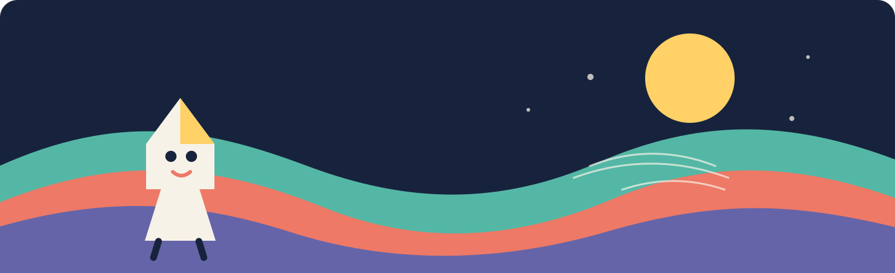
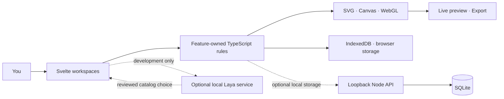

<div align="center">



# 2D Maker

### Make a scene. Shape a character. Bring it to life.

**A local-first art studio for editable 2D scenes, character motion, and starter 3D worlds.**

[](https://svelte.dev/)
[](https://www.typescriptlang.org/)
[](https://vite.dev/)
[](docs/design.md)

[Explore the workspaces](#the-studio) · [Run locally](#get-started) · [Read the architecture](docs/design.md) · [Contribute](docs/contributing.md)

</div>

---

2D Maker turns clear design rules into art you can shape yourself. Build with SVG, Canvas,
browser APIs, and seeded procedural systems. **No LLM or hosted generation service is required.**
Optional local Laya suggestions choose only from existing catalogs; every suggestion stays under
your control.

> **Small tools. Clear layers. Art you can edit.** 2D Maker keeps creation local, visual, and
> understandable—from the first shape to the exported scene.

## The studio

| Workspace | Create | Available today |
|:--|:--|:--|
| ✳ **Character** | Front-facing character art | Bounded proportions and joints · five profiles · Wave preview · SVG export |
| ◒ **Landscape** | Layered scene compositions | Seeded SVG scenes · landform and lighting controls · styles · saved recipes |
| ↗ **Image + motion** | Animated illustrations | Image and text layers · masks · motion previews · project files · SVG export |
| ▦ **Tile backgrounds** | Seamless decorative patterns | Seeded motifs · px/mm sizing · repeat preview · single-tile and proof-sheet SVG |
| ◇ **3D artwork** | Starter forms and compositions | Five primitive groups · orbit camera · two projections · PNG preview |

These are focused creation tools, not a full illustration suite or timeline editor. See [current
status](docs/status.md), [requirements](docs/requirements.md), and [known issues](docs/issues.md)
for delivered scope and open limits.

## How it fits together



The app runs in the browser without a hosted backend. An optional loopback Node service stores
landscape templates in SQLite, with IndexedDB migration, offline cache, and queued edits. Laya runs
separately through the development proxy. **Each distinct kind of work owns a feature module and
a labeled drawer section.** Keep its UI, rules, IO, and rendering together; share behavior only
when multiple features need the same contract. See [architecture and data flow](docs/design.md) and
[backend boundaries](research/backend-architecture.md).

## Technology

| Area | Implementation |
|:--|:--|
| Interface | Svelte 5, TypeScript 6, SCSS |
| Development and build | Vite 8, Sass, Svelte checks |
| 2D | SVG, Canvas 2D, CSS animation, typed motion recipes |
| Image processing | TypeScript Web Worker with native synchronous fallback |
| 3D | Lazy-loaded Three.js and WebGL |
| Local persistence | IndexedDB and bounded browser recovery; optional loopback Node `node:sqlite` service |
| Verification | `svelte-check`, TypeScript, Node test runner, production build |

The browser build does not bundle model weights or call a hosted AI API. Exact dependency versions
and scripts live in [`package.json`](package.json).

## Get started

**Requirements:** Node.js 24 or newer.

```sh
npm ci
npm run dev
```

Open the local Vite URL. On Windows, the [launcher](scripts/README.md) can start the app and write
server/crash logs. To run checks and a production build:

```sh
npm run verify
```

The optional Laya service has separate setup and downloads model weights on first use. Manual
editing remains available without it. See [local setup](scripts/README.md).

## Design approach

The product favors clear shapes, small palettes, repeatable scenes, and motion that explains a
change. Procedural choices stay bounded and inspectable; the user keeps control of the final art.
Free or open assets are candidates only after checking the individual file’s license and source.
See [asset sources and intake rules](docs/roadmap/free-2d-assets.md).

## Project map

```text
src/
  app/                         workspace shell and feature composition
  features/
    character/                 geometry, proportions, posing, SVG export
    landscape/                 seeded scenes, styles, templates, storage
    procedural-background/    seamless SVG tile recipes, preview, and export
    image-animation/           image/text layers, masks, motion, project IO
    animation/                 shared motion definitions and recipes
    laya/                      bounded decisions and optional service adapter
    three-d/                   Three.js scenes and starter geometry
    artwork-feedback/          local ratings and export
  platform/                    shared browser utilities
backend/                       optional loopback API and SQLite boundary
docs/                          requirements, workflows, decisions, contribution log
research/                      design and technology evidence
```

## Contribute

Good contributions here are focused, visual, and easy to review. Add one scene rule, improve one
workflow, fix one export edge case, or make one piece of documentation clearer.

1. [Run the app](#get-started) and explore a workspace.
2. Choose a bounded item from the [task queue](docs/tasks/README.md), or open an
   [issue](https://github.com/dr-week/NO-AI-2D-GAME-ASSET-Designer/issues).
3. Read [the contribution guide](docs/contributing.md), check active file ownership in the
   [contribution log](docs/contributions/README.md), and keep your change small.

No special art pipeline or hosted AI account is needed. Clear TypeScript, repeatable output, and a
short handoff make a strong first contribution.

Useful references: [project status](docs/status.md) · [task queue](docs/tasks/README.md) ·
[UI flows](docs/ui-ux/README.md) · [technology register](docs/roadmap/technology-register.md) ·
[System 1 architecture](research/laya-integration.md) · [research index](research/stack-and-architecture.md).

## What we learn from other tools

Each product solves a different part of the art workflow. These are design references, not claims
of feature parity or promises to reproduce their full toolsets.

| Tool | Marquee strength | Useful comparison for 2D Maker |
|:--|:--|:--|
| [Rive](https://rive.app/docs/auth) | Interactive vector animation driven by state machines and runtimes | Keep motion understandable and previewable; 2D Maker has simple clips, not interactive state machines. |
| [Synfig](https://wiki.synfig.org/Features) | Layered vector animation with keyframes and interpolation | A reference for future bounded clips and timing controls; an editable timeline remains later work. |
| [OpenToonz](https://opentoonz.readthedocs.io/en/latest/working_in_xsheet.html) | Xsheet/timeline organizes layers across frames | Treat a future timeline as its own focused animation tool, separate from artwork-creation controls. |
| [Blender Grease Pencil](https://docs.blender.org/manual/en/latest/grease_pencil/) | Frame animation, editable layers, masks, and drawing inside 3D scenes | Keep character, layer, and 3D scene workflows distinct; do not force every workflow into one crowded editor. |
| [Lottie](https://developers.lottiefiles.com/) | Portable JSON animation format with platform runtimes | Compare export formats carefully; 2D Maker currently exports animated SVG and does not write Lottie files. |

Detailed architecture notes and sources: [animation systems](research/animation-systems.md).

## Feature roadmap, in separate slices

These are scoped directions from the [requirements](docs/requirements.md) and
[task queue](docs/tasks/README.md), not a release schedule. Each independently usable feature gets
its own module and focused drawer entry; steps within that feature stay grouped in its workspace.

### Character motion

**Now:** bounded posing and a Wave preview. **Next:** additional bounded clips and editable
timing; add a timeline only when playback needs justify it. No state-machine runtime is required.

### Layered illustration

**Now:** image/text layers, masks, motion preview, and animated SVG export. **Next:** editable
paths and mask correction as separate tasks; frame-sequence export follows when prioritized.

### Landscapes

**Now:** seeded landscape scenes, style controls, and saved recipes. **Next:** reviewed scene
profiles, editable layers, and wave motion as independently scoped additions.

### Tile backgrounds

**Now:** a separate seeded SVG tile maker with unit-aware sizing, density/color controls, repeat
preview, and single-tile or proof-sheet export. **Next:** raster formats and print profiles, after
production requirements are defined.

### 3D artwork

**Now:** procedural starter forms, camera views, and PNG preview. **Possible next slices:** object
transforms, scene save/restore, and model import. Keep this workspace separate from 2D drawing.

Potential users and paid workflows remain hypotheses; no market-size or willingness-to-pay study
has been completed.

## Licensing

The repository currently has no `LICENSE` file. Do not assume source redistribution rights.
Third-party artwork has its own license and provenance requirements.

---

<div align="center">

**Designed for small, repeatable, human-directed art workflows.**

Copyright © 2026 Danger Labs

</div>
