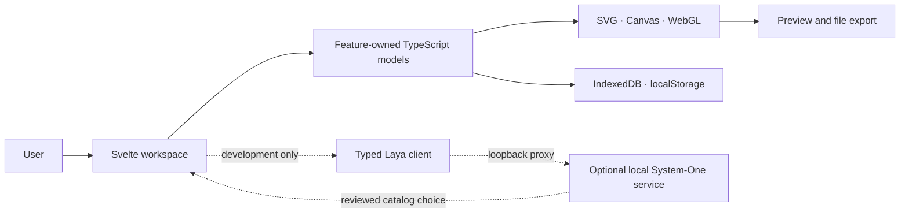

# 2D Maker

**A local-first workspace for editable 2D assets, simple motion graphics, and starter 3D artwork.**

[](https://svelte.dev/)
[](https://www.typescriptlang.org/)
[](https://vite.dev/)
[](docs/design.md)

2D Maker uses explicit scene data, seeded rules, SVG, Canvas, and browser APIs. No LLM, hosted
model API, application server, or database is required. An optional local System-One service can
suggest existing character or landscape catalog choices in development; suggestions require review
and manual apply. It is not an image generator.

## Product

| Workspace | Available now | Current boundary |
|---|---|---|
| Character | T-pose editing, bounded proportions/joints, Wave clip, SVG export, rule-based profiles | One built-in clip; clothing and deformation quality need more work. |
| Landscape | Seeded SVG scenes, landform/composition/environment/light/style controls, saved recipes | Starter artwork; artist-reviewed asset and regional-style catalogs are future work. |
| Image + text | Layers, guided masks, motion previews, project JSON, animated SVG export, local feedback | Editable paths, mask correction, and frame-sequence export are not implemented. |
| 3D artwork | Five starter groups, camera controls, Three.js preview, PNG preview export | Starter primitives; transforms, import, and scene save/restore are future work. |

See [current status](docs/status.md), [requirements](docs/requirements.md), and
[open issues](docs/issues.md) for the maintained scope and known limits.

## Architecture



Production is a static browser app. It has no application API, shared database, account system, or
cloud sync. UI, pure scene rules, persistence, and export have separate feature owners. Imported
files are validated before they replace active state. See [design and data flow](docs/design.md).

## Technology

| Layer | Technology in this repository |
|---|---|
| UI | Svelte 5, TypeScript 6 |
| Styles | SCSS, compiled with Sass |
| Development and build | Vite 8, `@sveltejs/vite-plugin-svelte` |
| 2D graphics | SVG, Canvas 2D, CSS animation, typed motion recipes |
| Image processing | TypeScript Web Worker and `OffscreenCanvas` when available; synchronous fallback |
| 3D | Three.js, WebGL renderer, `OrbitControls`; loaded when the 3D workspace opens |
| Local data | IndexedDB for landscape recipes; bounded `localStorage` project recovery; local feedback records |
| Checks | `svelte-check`, TypeScript compiler, Node.js test runner |
| Optional decisions | Development-only local Laya service; no LLM API or bundled model weights |

The application uses Svelte and Three.js. Sass, Vite, TypeScript, and Svelte checks are
development tooling. See [`package.json`](package.json) for exact dependency ranges.

## Run locally

Requires Node.js 24 or newer.

```sh
npm ci
npm run dev
```

On Windows, use the [local launcher](scripts/README.md). It records server startup and crash logs.

```sh
npm run verify
```

This runs type/component checks, focused tests, and a production build. Individual commands are
listed in [`package.json`](package.json). The optional Laya setup installs separately and downloads
model weights on first use; see [launcher guidance](scripts/README.md). Manual controls work
without it.

## Research and positioning

Related tools illustrate different parts of the workflow:

- [Rive](https://rive.app/editor) combines vector animation, state machines, and runtime playback.
- [Lottie](https://developers.lottiefiles.com/) provides a JSON animation format and platform runtimes.
- [Synfig](https://wiki.synfig.org/Doc%3AOverview) is an open-source vector animation application.
- [Blender Grease Pencil](https://www.blender.org/features/story-artist/) combines 2D drawing and animation with a 3D scene.

2D Maker currently focuses on local, deterministic starter assets and editable SVG-oriented
workflows. It does not replace a full timeline editor, illustration suite, or interactive runtime.
Architecture, art direction, asset licensing, and System-One findings are indexed in the
[art-direction research](research/art-direction-foundations.md), [stack review](research/stack-and-architecture.md),
[Laya analysis](research/laya-integration.md), and [technology register](docs/roadmap/technology-register.md).

### Business hypotheses — not market validation

Potential users include independent animators, small studios, educators, and teams that need
editable starter graphics without a cloud generation workflow. Potential product paths include:

1. A paid workflow tier for repeatable scene templates and production exports.
2. A curated template and asset catalog with creator attribution and verified licenses.
3. Studio-oriented project organization or private sharing, if customer research justifies adding a service.

These are hypotheses; no pricing, market size, or willingness-to-pay study has been completed.
Before building paid features, test whether a small group of target users can complete a real task
faster, reuse the output, and value the editable files enough to pay for that workflow.

## Research and contribution

Useful research areas:

- Measure time to create and revise a reusable character, landscape, or motion asset.
- Compare seeded procedural scenes with artist-authored templates using blinded human review.
- Benchmark mask quality, memory, and latency on representative browsers and hardware.
- Evaluate optional catalog suggestions on held-out briefs; report agreement and uncertainty.
- Track asset provenance, license terms, format, and permitted modifications before bundling assets.

Research reports should name the question, method, software/version, test cases, results, and limits.
Do not treat user ratings as training data or claim quality from model confidence alone.

For code contributions, read [contributing](docs/contributing.md), check active file ownership in
the [contribution log](docs/contributions/README.md), and update the relevant requirements, status,
or UI flow document when behavior changes. Keep the change focused and record exact files and
checks. Research and future work stay in the [task queue](docs/tasks/README.md) and
[technology register](docs/roadmap/technology-register.md).

## Source map

- `src/app/` — workspace shell and feature composition
- `src/features/character/` — character geometry, motion, controls, and export
- `src/features/landscape/` — scene recipes, renderers, templates, storage, and SVG export
- `src/features/image-animation/` — image/text layers, masks, motion, project IO, and export
- `src/features/animation/` — shared motion definitions and template recipes
- `src/features/laya/` — bounded rules and optional local service boundary
- `src/features/three-d/` — Three.js scene and starter geometry
- `src/features/artwork-feedback/` — local artwork ratings and export
- `src/platform/` — shared browser utilities
- `docs/` — product requirements, architecture, contribution logs, workflows, and plans
- `research/` — evidence and design decisions

## Documentation

- [Status](docs/status.md) · [Requirements](docs/requirements.md) · [Architecture](docs/design.md) · [Issues](docs/issues.md)
- [Contributing](docs/contributing.md) · [Contribution history](docs/contributions/README.md) · [Task queue](docs/tasks/README.md)
- [UI flows](docs/ui-ux/README.md) · [Free asset sources and licensing](docs/roadmap/free-2d-assets.md)
- [Technology register](docs/roadmap/technology-register.md) · [Animation systems](research/animation-systems.md) · [Art direction](research/art-direction-foundations.md) · [System One](research/laya-integration.md)

## Licensing

No repository `LICENSE` file is currently present. Do not assume the application source is licensed
for redistribution. Third-party assets require separate source and license records.

---

Copyright © 2026 Danger Labs. All rights reserved.
